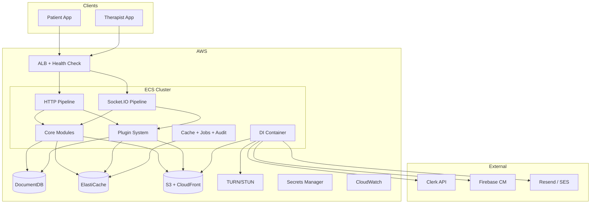

# MWP Unified Backend — Final Architecture (v6)

## Decisions

| Decision | Choice | Abstracted Behind |
|----------|--------|-------------------|
| Auth | Clerk (validate only, no own JWTs) | `AuthProvider` |
| Chat | Socket.IO | `MessagingProvider` |
| Video | WebRTC + TURN/STUN | `VideoProvider` |
| Storage | AWS S3 (streaming upload) | `StorageProvider` |
| Notifications | FCM primary, **email fallback** | `NotificationProvider` + `EmailProvider` |
| Database | MongoDB (any host) | `MONGODB_URI` env var |
| Deploy | AWS ECS Fargate | — |
| Extensibility | Plugin system | `PluginBase` + `PluginManager` |
| API Versioning | `/api/v1/...` prefix | All modules + plugins |
| Deletion | Soft delete only | `softDelete.js` plugin |
| Timestamps | UTC storage, ISO 8601 | `date-fns-tz` conversion |
| API Docs | Swagger/OpenAPI 3.0 | Non-prod only at `/api/v1/docs` |
| CORS | Per-environment origin whitelist | `config/cors.js` + Socket.IO cors |

---

## System Overview



---

## Project Structure

> All routes use `/api/v1/...`. Future breaking changes use `/api/v2/...` without removing v1.

```
backend/
├── src/
│   ├── app.js
│   ├── server.js                           # Bootstrap + DI + graceful shutdown
│   ├── config/
│   │   ├── env.js                          # Joi validation (includes ALLOWED_ORIGINS, email keys)
│   │   ├── database.js
│   │   ├── redis.js
│   │   ├── cors.js                         # Per-environment origin whitelist (Express + Socket.IO)
│   │   ├── providers.js
│   │   ├── featureFlags.js
│   │   └── swagger.js                      # OpenAPI 3.0 base spec + schemas
│   ├── container/
│   │   └── index.js                        # DI: all providers + cache + jobs + breakers
│   ├── providers/
│   │   ├── interfaces/
│   │   │   ├── AuthProvider.js
│   │   │   ├── VideoProvider.js            # + getTurnCredentials
│   │   │   ├── MessagingProvider.js
│   │   │   ├── StorageProvider.js          # + streamUpload
│   │   │   ├── SMSProvider.js
│   │   │   ├── NotificationProvider.js
│   │   │   └── EmailProvider.js            # NEW — sendTransactional, sendBulk
│   │   ├── auth/ClerkAdapter.js
│   │   ├── video/WebRTCAdapter.js
│   │   ├── messaging/SocketIOAdapter.js
│   │   ├── storage/S3Adapter.js            # + streamUploadToS3 via @aws-sdk/lib-storage
│   │   ├── sms/MSG91Adapter.js
│   │   ├── notification/FCMAdapter.js
│   │   └── email/ResendAdapter.js          # NEW — Resend API implementation
│   ├── core/
│   │   ├── middleware/
│   │   │   ├── correlationId.js
│   │   │   ├── authMiddleware.js           # HTTP: Clerk session validation
│   │   │   ├── socketAuthMiddleware.js     # NEW — Socket.IO handshake auth
│   │   │   ├── rbac.js
│   │   │   ├── ownership.js
│   │   │   ├── rateLimiter.js
│   │   │   ├── validate.js
│   │   │   ├── fileUpload.js              # Updated: streaming to S3, no full RAM buffer
│   │   │   ├── idempotency.js             # NEW — Idempotency-Key for booking creation
│   │   │   ├── auditLog.js
│   │   │   ├── responseTimer.js
│   │   │   ├── errorHandler.js
│   │   │   └── requestLogger.js
│   │   ├── cache/cacheManager.js
│   │   ├── jobs/jobQueue.js                # BullMQ — push, email fallback, audit
│   │   ├── plugins/PluginManager.js, PluginBase.js
│   │   ├── privacy/dataPrivacyService.js
│   │   ├── shutdown.js
│   │   └── utils/
│   │       ├── apiResponse.js, asyncHandler.js, constants.js
│   │       ├── logger.js                   # child({ correlationId }) support
│   │       ├── paginator.js, softDelete.js, circuitBreaker.js
│   ├── modules/
│   │   ├── auth/                           # + OTP brute force protection in service
│   │   ├── patient/
│   │   ├── therapist/                      # + TherapistSearchService
│   │   ├── booking/                        # + double-booking + idempotency
│   │   ├── assessment/
│   │   └── admin/
│   ├── plugins/
│   │   ├── chat/                           # + sequenceNumber ordering
│   │   ├── video/
│   │   ├── exercise/
│   │   ├── session/
│   │   ├── progress/
│   │   └── notification/                   # + email fallback on FCM failure
│   ├── models/
│   │   ├── User.model.js, OTP.model.js, OnboardingDraft.model.js
│   │   ├── AuditLog.model.js, Notification.model.js
│   ├── integrations/clerk.js
│   └── docs/                               # NEW — Swagger YAML specs per module (optional)
├── scripts/seed-exercises.js, seedAdmin.js
├── docker-compose.yml, Makefile
├── docs/runbooks/restore.md
├── .env.example / .env.development / .env.staging / .env.production / .env.local
├── Dockerfile
└── package.json
```

---

## v6 Additions (23–30)

### 23. Socket.IO Authentication on Handshake

```js
// core/middleware/socketAuthMiddleware.js
module.exports = function socketAuthMiddleware(authProvider) {
  return async (socket, next) => {
    const token = socket.handshake.auth?.token;
    if (!token) return next(new Error('No auth token'));
    try {
      const user = await authProvider.verifyToken(token);
      socket.data.user = user;
      socket.data.correlationId = socket.handshake.auth?.correlationId || require('uuid').v4();
      next();
    } catch (err) {
      next(new Error('Unauthorized'));
    }
  };
};

// In server.js during Socket.IO init:
const io = new Server(server, { cors: corsConfig }); // uses same whitelist
io.use(socketAuthMiddleware(container.auth));
// All event handlers access socket.data.user — no re-validation needed per event
```

Chat and Video plugins depend on `socket.data.user` being populated by this middleware.

### 24. OTP Brute Force Protection

```js
// In auth.service.js
async verifyOTP(identifier, code) {
  // 1. Check if locked
  const locked = await redis.get(`otp:locked:${identifier}`);
  if (locked) throw new AppError('Account locked. Try again in 15 minutes.', 429);

  // 2. Validate OTP against DB
  const otp = await OTP.findOne({ phone: identifier, code, expiresAt: { $gt: new Date() } });
  if (!otp) {
    // 3. Increment failed attempts
    const attempts = await redis.incr(`otp:attempts:${identifier}`);
    await redis.expire(`otp:attempts:${identifier}`, 900); // 15 min TTL
    if (attempts >= 5) {
      await redis.setex(`otp:locked:${identifier}`, 900, 'locked');
      await OTP.deleteMany({ phone: identifier }); // invalidate all OTPs
      throw new AppError('Too many attempts. Locked for 15 minutes.', 429);
    }
    throw new AppError(`Invalid OTP. ${5 - attempts} attempts remaining.`, 401);
  }

  // 4. Success — clear counters
  await redis.del(`otp:attempts:${identifier}`, `otp:locked:${identifier}`);
  await otp.deleteOne();
  return { success: true };
}

async sendOTP(identifier) {
  const locked = await redis.get(`otp:locked:${identifier}`);
  if (locked) throw new AppError('Account locked. Try again later.', 429);
  // ... generate and send OTP
}
```

### 25. Swagger/OpenAPI Documentation

```js
// config/swagger.js
const swaggerJsdoc = require('swagger-jsdoc');
module.exports = swaggerJsdoc({
  definition: {
    openapi: '3.0.0',
    info: { title: 'MWP API', version: '1.0.0', description: 'Moment with Features — Unified Backend' },
    servers: [
      { url: process.env.API_BASE_URL || 'http://localhost:3000', description: process.env.NODE_ENV },
    ],
    components: {
      securitySchemes: { BearerAuth: { type: 'http', scheme: 'bearer', bearerFormat: 'Clerk Session Token' } },
      schemas: { /* PaginatedResponse, ErrorResponse, common models */ },
    },
    security: [{ BearerAuth: [] }],
  },
  apis: ['./src/modules/**/routes.js', './src/plugins/**/routes.js'],
});

// In app.js — mounted OUTSIDE auth, only non-prod:
if (process.env.NODE_ENV !== 'production') {
  const swaggerUi = require('swagger-ui-express');
  app.use('/api/v1/docs', swaggerUi.serve, swaggerUi.setup(swaggerSpec));
}
```

Both frontend teams access live docs at `/api/v1/docs` in dev/staging. Returns 404 in production.

### 26. Idempotency Keys for Booking Creation

```js
// core/middleware/idempotency.js
function idempotency(req, res, next) {
  const key = req.headers['idempotency-key'];
  if (!key) return res.status(400).json({ success: false, error: 'Idempotency-Key header required' });

  const redisKey = `idempotent:${req.user._id}:${key}`;

  // Check for cached response
  const cached = await redis.get(redisKey);
  if (cached) return res.status(200).json(JSON.parse(cached));

  // Intercept response to cache it
  const originalJson = res.json.bind(res);
  res.json = (body) => {
    if (res.statusCode >= 200 && res.statusCode < 300) {
      redis.setex(redisKey, 86400, JSON.stringify(body)); // 24hr TTL
    }
    return originalJson(body);
  };
  next();
}

// Applied to booking creation only:
router.post('/', auth, rbac('patient'), idempotency, validate(bookingSchema), controller.create);
```

### 27. Chat Message Ordering

**Message model updated:**
```js
MessageSchema.add({ sequenceNumber: { type: Number, required: true } });
MessageSchema.index({ roomId: 1, sequenceNumber: 1 }); // replaces createdAt for ordering
```

**Send flow:**
```js
// In chat.service.js
async sendMessage(roomId, senderId, text) {
  const seq = await redis.incr(`chat:seq:${roomId}`);  // atomic increment
  const msg = await Message.create({ roomId, sender: senderId, text, sequenceNumber: seq });
  container.messaging.emitToRoom(roomId, 'new_message', msg);
  return msg;
}
```

**Pagination:** `GET /api/v1/chat/rooms/:roomId/messages?afterSeq=150&limit=50` uses `sequenceNumber` for cursor, more reliable than timestamps for ordering.

### 28. S3 Streaming Upload

```js
// In S3Adapter.js
const { Upload } = require('@aws-sdk/lib-storage');

async streamUpload(fileStream, key, mimeType) {
  const upload = new Upload({
    client: this.client,
    params: { Bucket: this.bucket, Key: key, Body: fileStream, ContentType: mimeType },
    queueSize: 4, partSize: 5 * 1024 * 1024, // 5MB parts
  });
  const result = await upload.done();
  return { key, url: result.Location };
}
```

**Updated fileUpload.js:** multer parses multipart + validates MIME/size/signature → pipes `req.file.buffer` (small files) or `req.file.stream` (large) to `streamUploadToS3`. Under concurrent uploads, RAM stays bounded.

### 29. Email Fallback for Critical Notifications

**EmailProvider interface:**
```js
class EmailProvider {
  async sendTransactional(to, { subject, templateId, variables }) { throw new Error('Not implemented'); }
  async sendBulk(recipients, { subject, templateId, variables }) { throw new Error('Not implemented'); }
}
```

**ResendAdapter:** Implements EmailProvider using Resend API (or swap to SES via config).

**Fallback logic in notification job worker:**
```js
// In jobs/workers/notificationWorker.js
async function processNotification(job) {
  const { userId, title, body, type } = job.data;
  const user = await User.findById(userId).select('fcmToken email').lean();

  // 1. Try FCM push
  let pushSuccess = false;
  if (user.fcmToken) {
    try { await container.notification.sendPush(userId, { title, body }); pushSuccess = true; }
    catch (err) { logger.warn({ event: 'FCM_FAILED', userId, err: err.message }); }
  }

  // 2. Email fallback for critical types
  const CRITICAL = ['booking_confirmed', 'booking_cancelled', 'session_reminder', 'therapist_verified', 'account_deleted'];
  if (!pushSuccess && CRITICAL.includes(type) && user.email) {
    await container.email.sendTransactional(user.email, { subject: title, templateId: type, variables: job.data });
  }
}
```

Env: `EMAIL_PROVIDER=resend`, `RESEND_API_KEY`, `EMAIL_FROM`.

### 30. Environment-Specific CORS

```js
// config/cors.js
const allowedOrigins = (process.env.ALLOWED_ORIGINS || '').split(',').map(s => s.trim()).filter(Boolean);

const corsOptions = {
  origin: (origin, callback) => {
    if (!origin || allowedOrigins.includes(origin)) callback(null, true);
    else callback(new Error('Not allowed by CORS'));
  },
  credentials: true,
  methods: ['GET', 'POST', 'PUT', 'PATCH', 'DELETE'],
};

module.exports = corsOptions;
```

```env
# .env.development
ALLOWED_ORIGINS=http://localhost:3000,http://localhost:8081,exp://192.168.x.x:8081

# .env.staging
ALLOWED_ORIGINS=https://staging-patient.mwp.app,https://staging-therapist.mwp.app

# .env.production
ALLOWED_ORIGINS=https://patient.mwp.app,https://therapist.mwp.app
```

**Socket.IO uses same whitelist:**
```js
const io = new Server(server, { cors: corsOptions }); // same config object
```

`ALLOWED_ORIGINS` added to `config/env.js` Joi schema as required string.

---

## Redis Key Patterns (Complete)

| Pattern | Purpose | TTL |
|---------|---------|-----|
| `user:{id}` | Profile cache | 15 min |
| `exercise:{id}` | Exercise cache | 1 hr |
| `exercises:bodyPart:{part}` | List cache | 1 hr |
| `questionnaire:{bodyPart}` | Template cache | 24 hr |
| `slots:{therapistId}:{date}` | Availability cache | 5 min |
| `dashboard:{patientId}` | Dashboard cache | 5 min |
| `lock:slot:{therapistId}:{date}:{slot}` | Double-booking lock | 5 sec |
| `otp:attempts:{identifier}` | Failed OTP counter | 15 min |
| `otp:locked:{identifier}` | OTP lockout flag | 15 min |
| `idempotent:{userId}:{key}` | Booking idempotency | 24 hr |
| `chat:seq:{roomId}` | Message sequence counter | Permanent |
| `featureFlags` | Flag cache | 10 min |

---

## HTTP Middleware Pipeline

```
GET /health                    → bypasses everything
GET /api/v1/docs (non-prod)    → bypasses auth (Swagger UI)

All other HTTP routes:
  → correlationId (uuid + X-Correlation-ID)
  → helmet(CSP/HSTS) → cors(per-env whitelist) → mongoSanitize → xss-clean
  → rateLimiter → responseTimer → requestLogger → express.json
  → authMiddleware (Clerk session via AuthProvider)
  → rbac(roles) → ownership(resourceType)
  → idempotency (booking creation only)
  → fileUpload (upload routes only — streaming to S3)
  → validate(joiSchema) → audit(action, resource)
  → controller → paginator → apiResponse
  → errorHandler (sanitized in prod)
```

## Socket.IO Middleware Pipeline

```
WebSocket upgrade request:
  → Socket.IO CORS check (same ALLOWED_ORIGINS whitelist)
  → socketAuthMiddleware (Clerk token from handshake.auth.token)
    → success: socket.data.user + socket.data.correlationId populated
    → failure: connection rejected with Error('Unauthorized')
  → namespace routing (/chat or /video)
  → event handlers (access socket.data.user, no re-auth per event)
```

---

## Complete API Summary (all `/api/v1/...`)

### Infrastructure
| Method | Endpoint | Auth |
|--------|----------|------|
| GET | `/health` | No |
| GET | `/api/v1/docs` | No (non-prod only) |

### Core Modules (55+)

| Group | # | Key Routes |
|-------|---|------------|
| Auth | 9 | send-otp (**with lock check**), verify-otp (**with brute force protection**), login, refresh, logout, me, webhook, draft CRUD |
| Patient | 6 | onboarding, profile, dashboard, assigned-therapist, account deletion |
| Therapist | 13 | onboarding, profile, clients, availability, dashboard, account deletion, **search** |
| Booking | 7 | slots, CRUD (**idempotency + double-booking prevention**), cancel, complete |
| Assessment | 11 | body-parts, questions, session CRUD, respond, complete, history, tracking CRUD |
| Admin | 7 | verify therapist, pending, users, stats, audit logs |

### Plugins (32+)

| Plugin | REST | Socket Events |
|--------|------|---------------|
| Chat | 7 (**afterSeq pagination**) | `send_message` (**with sequenceNumber**), `typing`, `mark_read`, `join_room` |
| Video | 4 | `offer`, `answer`, `ice_candidate`, `join_call`, `end_call` + TURN |
| Exercise | 9 | — |
| Session | 3 | — |
| Progress | 4 | — |
| Notification | 4 (**email fallback**) | — |

---

## Updated Dependencies

| Package | Purpose |
|---------|---------|
| `svix` | Clerk webhook signature verification |
| `opossum` | Circuit breaker |
| `date-fns-tz` | Timezone conversion |
| `bullmq` | Async job queue |
| `firebase-admin` | FCM push notifications |
| `redlock` | Distributed locking |
| `uuid` | Correlation IDs |
| `swagger-jsdoc` | **NEW — OpenAPI spec generation from JSDoc** |
| `swagger-ui-express` | **NEW — Swagger UI hosting** |
| `@aws-sdk/lib-storage` | **NEW — S3 streaming multipart upload** |
| `resend` | **NEW — transactional email (fallback)** |
| express, mongoose, socket.io, @clerk/clerk-sdk-node, @socket.io/redis-adapter, ioredis, joi, express-rate-limit, rate-limit-redis, helmet, cors, morgan, winston, multer, @aws-sdk/client-s3, @aws-sdk/s3-request-presigner, dotenv, mongoose-field-encryption, express-mongo-sanitize, xss-clean | (unchanged) |

---

## AWS Deployment

| Service | Purpose |
|---------|---------|
| ECS Fargate | API containers, graceful shutdown on SIGTERM |
| ALB | HTTP + WebSocket, health check, **CORS enforced** |
| DocumentDB/Atlas | MongoDB — daily backups, 30-day retention, PITR |
| ElastiCache | Redis (cache, Socket.IO, rate limits, jobs, redlock, **OTP locks, idempotency, chat sequences**) |
| S3 + CloudFront | Exercise videos (12hr URLs), **streaming uploads** |
| EC2 (Coturn) or Managed TURN | TURN/STUN relay |
| Secrets Manager | All keys including `FIREBASE_SERVICE_ACCOUNT`, `RESEND_API_KEY` |
| CloudWatch | Logs with correlation IDs, p95 alarms |
| ECR | Docker image registry |

---

## Implementation Phases

| Phase | Scope |
|-------|-------|
| **1** | Scaffold `/api/v1/`, **docker-compose + Makefile**, **Swagger/OpenAPI setup**, DI container (all providers incl. **EmailProvider**), **correlationId middleware**, **socketAuthMiddleware**, **environment-specific CORS (Express + Socket.IO)**, Clerk adapter + webhook sig verification, **FCMAdapter + ResendAdapter**, User/Patient/Therapist models with soft delete, onboarding + drafts, RBAC, ownership, email uniqueness, indexes (incl. therapist search), field encryption, security headers, env validation, health check, admin module + seedAdmin.js, therapist credential verification, **file upload middleware (streaming to S3)**, **OTP brute force protection** |
| **2** | Plugin system, Booking module with timezone + **double-booking prevention + idempotency keys**, Assessment + TrackingSession, S3 adapter (12hr TTL + refresh + **streaming upload**), Exercise plugin, Redis caching, pagination, Notification plugin (**FCM + email fallback**), therapist search |
| **3** | Socket.IO adapter (**handshake auth enforced**), WebRTC + TURN/STUN, Chat plugin (**message sequence numbers**), Video plugin, WebSocket re-validation, job queue, push triggers for messages |
| **4** | Session plugin, Progress plugin, audit logging, response timer, seeds, feature flags, cache warming, data privacy (account deletion), push triggers for sessions |
| **5** | Dockerfile, ECS + graceful shutdown, TURN deployment, CloudFront, Secrets Manager, CloudWatch + correlation IDs, DB backup config + restore runbook, security audit |

---

## Verification Plan

### Automated
- `npm test` — Jest + mongodb-memory-server
- `npm run test:api` — supertest for all `/api/v1/` routes
- `npm run test:ws` — Socket.IO + WebRTC signaling
- `npm run test:providers` — each adapter in isolation
- `npm run test:security` — ownership, rate limiting, email uniqueness, webhook sig, **CORS, OTP locks**

### Test Cases (all 30 additions)

| # | Addition | Test Case |
|---|----------|-----------|
| 1 | API Versioning | Non-prefixed routes → 404 |
| 2 | Health Check | `/health` returns 200 without auth |
| 3 | TURN/STUN | `getTurnCredentials()` returns valid ICE config |
| 4 | AI Tracking | Create tracking → link to booking → retrieve |
| 5 | Pagination | All lists return `{ data, pagination: { hasNext, cursor } }` |
| 6 | Soft Delete | Deleted records excluded from `find()` |
| 7 | Timezone | Booking stored UTC, slot calc correct |
| 8 | Webhook Sig | Unsigned webhook → 401 |
| 9 | Circuit Breaker | 5 failures → open → fallback → auto-reset |
| 10 | Account Delete | PII replaced, medical records retained |
| 11 | URL Refresh | 12hr TTL, refresh returns new URL |
| 12 | Credential Verify | Unverified therapist hidden from search |
| 13 | Push Notifications | Booking created → FCM push received |
| 14 | Double Booking | Concurrent same-slot requests → one 201, one 409 |
| 15 | Admin Module | Non-admin → 403 on admin routes |
| 16 | Therapist Search | Filter by specialty + rating → only matching verified returned |
| 17 | Correlation ID | X-Correlation-ID in response, matching ID in logs |
| 18 | Graceful Shutdown | SIGTERM → in-flight completes → exit 0 |
| 19 | DB Backup | Snapshot exists, restore drill passes |
| 20 | File Upload | .exe → 400, >10MB → 400, valid PDF → 200 |
| 21 | Refresh Token | `/auth/refresh` proxies to Clerk, no custom JWT |
| 22 | Docker Compose | `make dev` → API responds on localhost:3000 |
| 23 | **Socket Auth** | **Connection without token → rejected; with valid token → socket.data.user set** |
| 24 | **OTP Brute Force** | **5 wrong OTPs → locked 15min; locked user can't request new OTP** |
| 25 | **Swagger Docs** | **GET `/api/v1/docs` → 200 in dev, 404 in production** |
| 26 | **Idempotency** | **Same Idempotency-Key twice → second returns cached response, no duplicate booking** |
| 27 | **Message Order** | **Two rapid messages → both have sequential sequenceNumbers, client sorts correctly** |
| 28 | **Streaming Upload** | **10MB upload under 10 concurrent users → container RSS stays under 256MB** |
| 29 | **Email Fallback** | **FCM fails (no token) on booking_confirmed → email sent to user** |
| 30 | **CORS Whitelist** | **Request from unlisted origin → blocked; listed origin → allowed; Socket.IO same** |

### Manual
- Swap `VIDEO_PROVIDER` env → zero code changes
- Connect to local/Atlas/DocumentDB → same code
- Same email both platforms → 409
- Logout mid-onboarding → re-login → resume
- Response times < 200ms under load
- TURN relay on mobile data
- `make dev` → full local env in <60s
- Kill container SIGTERM → no dropped requests
- Swagger UI usable by both frontend teams in staging

---

**Ready for your approval to begin Phase 1 implementation.**
